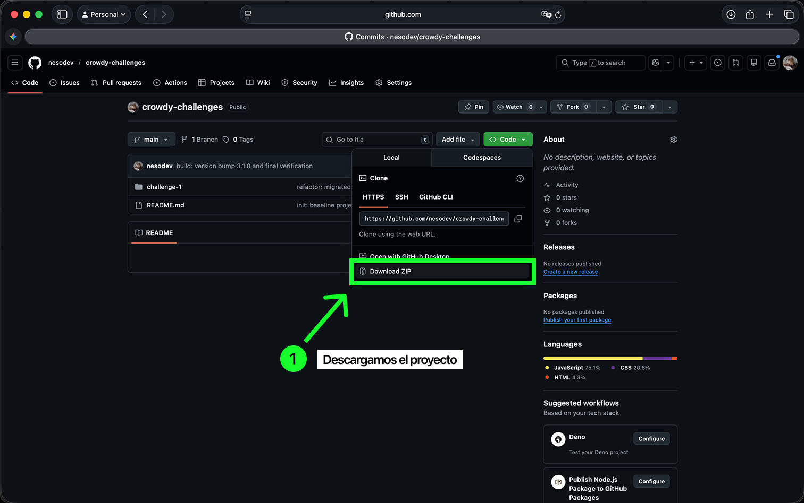
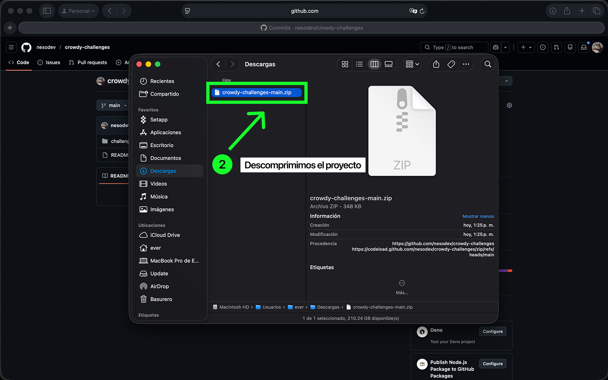
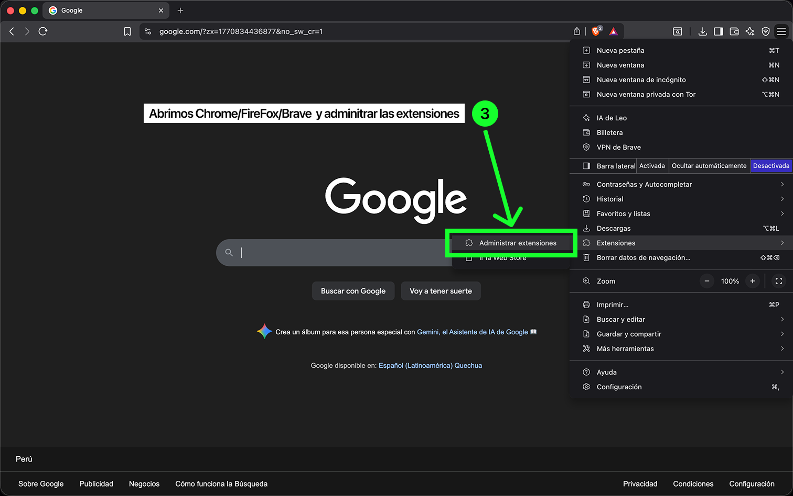
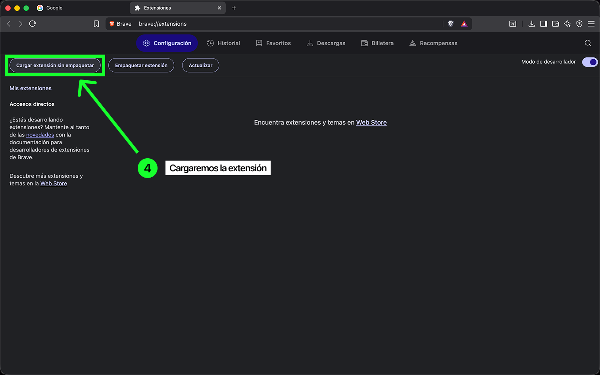
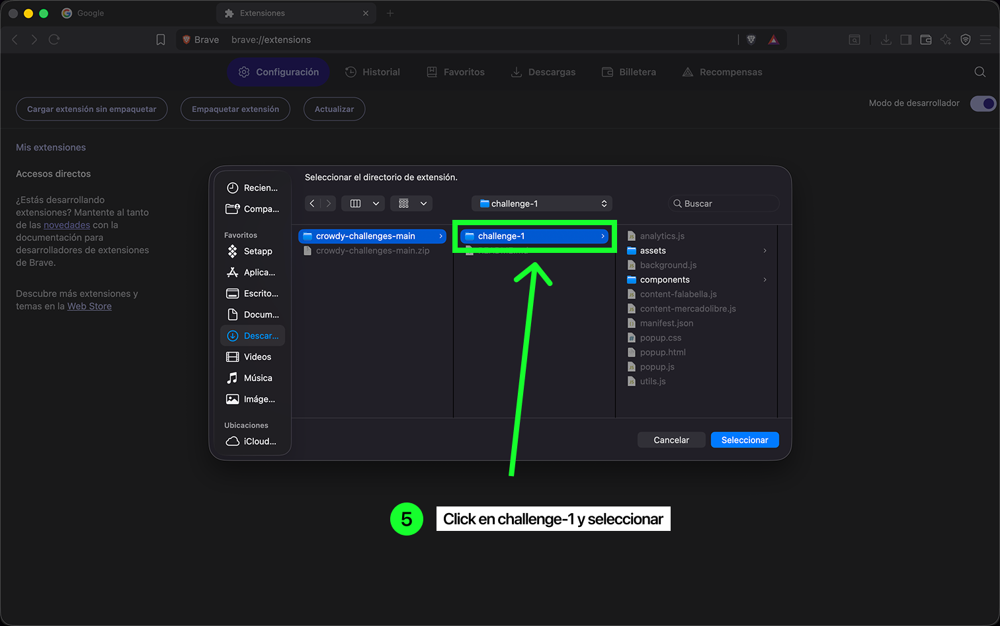
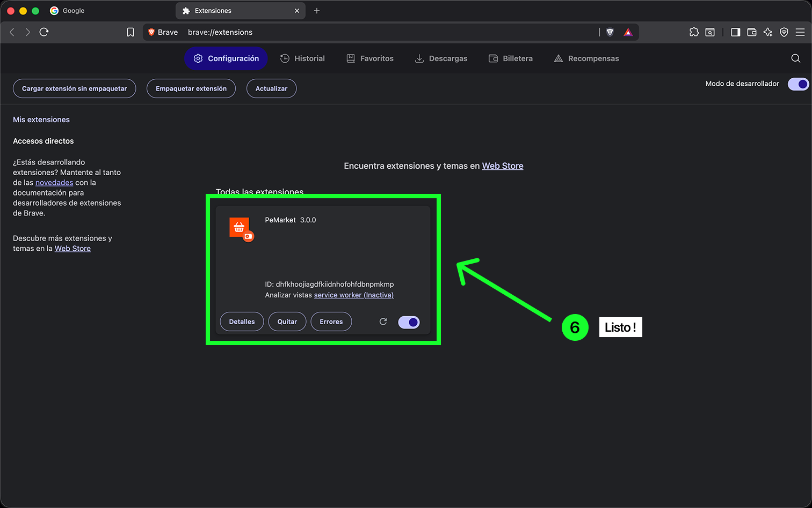
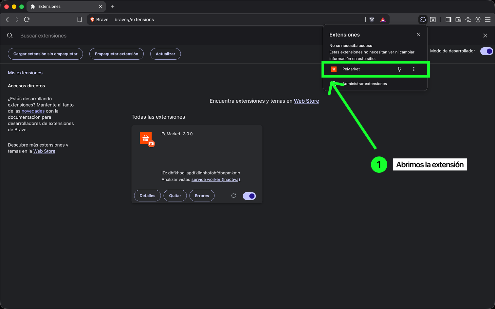
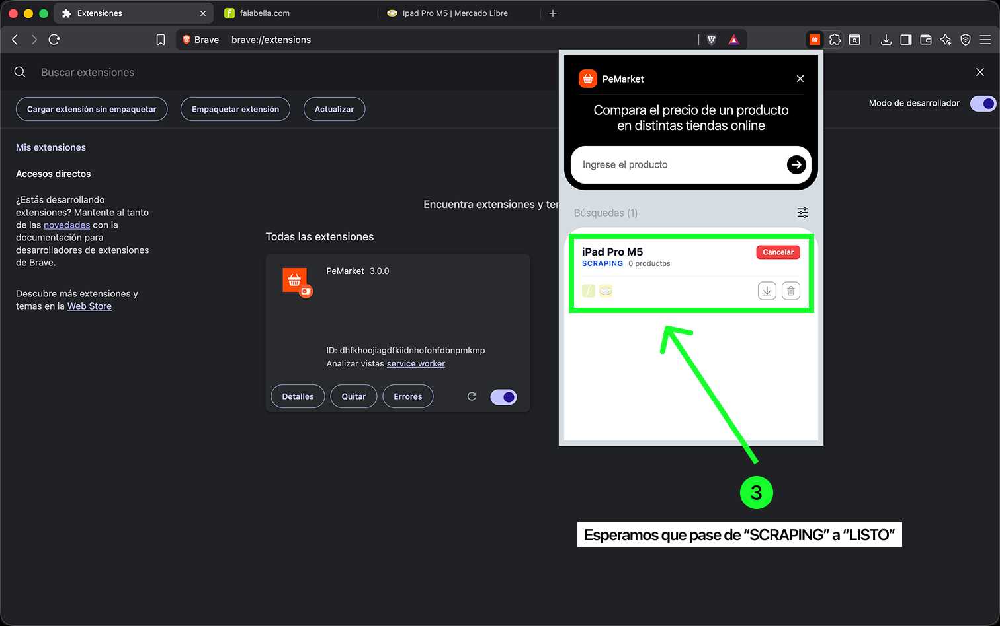
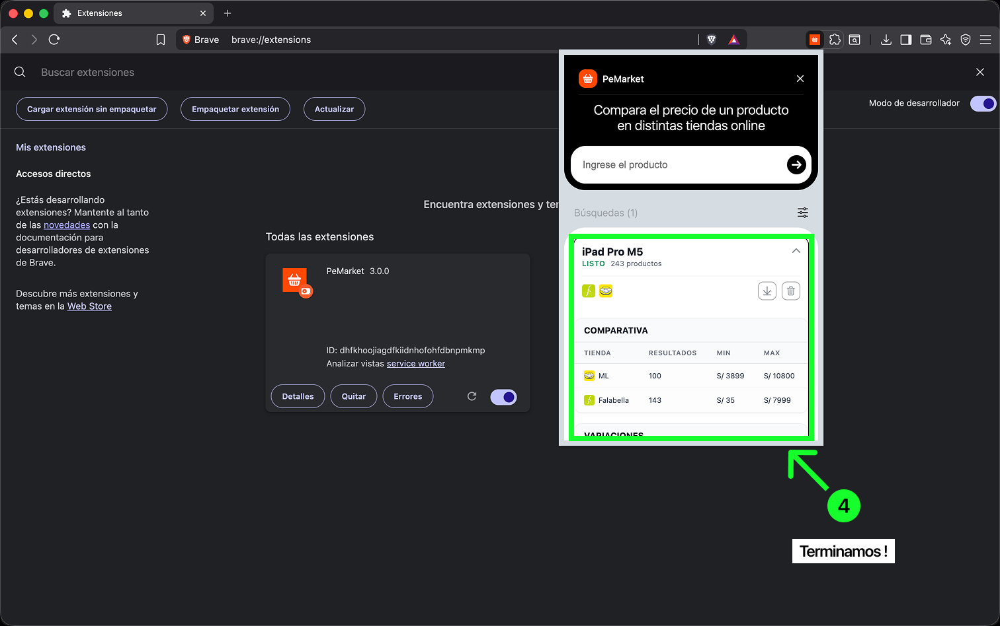

# PeMarket

Extension MV3 para Chrome/Brave que compara precios entre Falabella y MercadoLibre por keyword.

Se escribe el producto, se seleccionan las tiendas y la extension abre las pestanas necesarias, scrapea los resultados y muestra un dashboard con comparativa de precios, variaciones y recomendaciones.

## Stack

- Manifest V3 (Service Worker)
- Vanilla JS con ES Modules
- chrome.storage.local para persistencia
- Comunicacion persistente via tabs.connect / Port

## Estructura

```
challenge-1/
  manifest.json
  background.js          -> Service Worker, orquesta el scraping
  popup.html / popup.js  -> UI del popup
  popup.css
  analytics.js           -> Clustering, estadisticas y recomendaciones
  utils.js               -> Normalizacion de precios y productos
  content-falabella.js   -> Content script para Falabella
  content-mercadolibre.js -> Content script para MercadoLibre
  components/
    DataTable.js / .css   -> Tablas de comparativa, variaciones y recomendaciones
    KeywordItem.js / .css -> Card de cada keyword con estado y acciones
    KeywordList.js        -> Lista de keywords
    EmptyState.js         -> Estado vacio
  assets/
    icons/                -> Iconos de la UI
    markets/              -> Logos de Falabella y ML
    guide/                -> Capturas de instalacion y uso
```

## Instalacion

**1.** Descargar el proyecto desde GitHub (Code > Download ZIP)



**2.** Descomprimir el archivo ZIP



**3.** Abrir el navegador (Chrome, Brave, Edge) e ir a Administrar extensiones



**4.** Activar "Modo de desarrollador" y hacer click en "Cargar extension sin empaquetar"



**5.** Seleccionar la carpeta `challenge-1` dentro del proyecto descargado



**6.** La extension aparece instalada



## Uso

**1.** Abrir la extension desde la barra de extensiones del navegador



**2.** Escribir el nombre del producto en el input y seleccionar las tiendas donde se quiere buscar (Falabella, Mercado Libre o ambas)


**3.** La extension abre las pestanas de busqueda y comienza el scraping. Se puede cancelar en cualquier momento



**4.** Cuando termina, se despliega el dashboard con la comparativa de precios, variaciones detectadas y recomendaciones



## Interfaz del Popup

- Input para crear una nueva keyword
- Boton para agregar (flecha o Enter)
- Lista persistente de keywords guardadas en storage
- Por cada keyword:
  - Estado visible: Idle, Running (con animacion), Done, Error, Cancelled
  - Contador de productos obtenidos en tiempo real
  - Logos de tiendas activas con estado de progreso (pulsando = scrapeando, fijo = terminado)
  - Boton de cancelacion inmediata
  - Boton de descarga JSON
  - Boton de eliminar
  - Chevron para expandir/colapsar el dashboard de analisis
- Selector de tiendas (Falabella / MercadoLibre) para elegir donde buscar

## Scraping

Cada keyword lanza busquedas en paralelo en las tiendas seleccionadas. La extension abre pestanas automaticamente con la URL de busqueda correspondiente.

### Falabella
- Minimo 60 productos si existen
- Usa scroll infinito + paginacion como fallback
- Espera reactiva: en vez de un delay fijo, detecta cuando React termina de renderizar los productos (polling de skeletons vs pods reales)
- Tolerante a cambios de DOM: usa selectores multiples como fallback (`[data-pod="catalyst-pod"]`, `.pod`)

### MercadoLibre
- Minimo 100 productos si existen
- Navegacion por paginacion (next page via `window.location.href`)
- El content script se re-inyecta en cada pagina nueva y reporta productos parciales al background
- Selectores multiples para compatibilidad: `.poly-card`, `.ui-search-layout__item`, etc.

### Comunicacion

Se usa `chrome.runtime.connect` (Port) para mantener un canal persistente entre background y content scripts. Los mensajes son:

| Tipo | Direccion | Descripcion |
|------|-----------|-------------|
| `start` | background -> content | Inicia el scraping con remainingItems |
| `result` | content -> background | Envia productos parciales + flag finished |
| `error` | content -> background | Error durante el scraping |
| `cancel` | popup -> background | Cancela la busqueda activa |

No se usa `sendResponse` para resultados. La cancelacion cierra el tab del scraper y limpia el tracker interno en menos de 1 segundo.

## Estructura de datos

Cada producto se normaliza en `utils.js` antes de guardarse:

```json
{
  "id": "falabella-1707321600000-0",
  "site": "falabella",
  "keyword": "ipad pro m5",
  "timestamp": 1707321600000,
  "position": 0,
  "title": "Apple iPad Pro M5 11 pulgadas",
  "priceVisible": "S/ 5,499",
  "priceNumeric": 5499,
  "url": "https://www.falabella.com.pe/...",
  "seller": "Falabella",
  "isOfficial": true,
  "stars": 4.5,
  "reviews": 12,
  "brand": null
}
```

Los campos que no se pueden extraer quedan como `null` o `0`. El parser de precios maneja formatos peruanos (puntos como separador de miles, comas para decimales).

## Persistencia

Las keywords y resultados se guardan en `chrome.storage.local`. Al cerrar y reabrir el popup, el estado se recupera completo: keywords, resultados previos y estado de cada busqueda.

## Estadisticas y criterio de similitud

Al terminar el scraping de una keyword, el dashboard muestra tres tablas:

### Comparativa por tienda
Precio minimo, maximo, promedio y mediana por cada tienda. Los precios minimo y maximo son clickeables (llevan al producto).

### Variaciones (agrupacion por similitud)

El criterio de similitud agrupa productos por coincidencia de tokens en el titulo. Funciona asi:

1. Se tokeniza cada titulo: se pasa a minusculas, se eliminan caracteres especiales y se separa en palabras
2. Se compara contra los titulos ya agrupados usando la interseccion de tokens dividida entre la union (coeficiente de Jaccard)
3. Si el coeficiente supera un umbral (0.4), el producto se une al cluster existente. Si no, se crea un cluster nuevo
4. Para cada cluster se calcula: cantidad de productos, tiendas presentes, precio minimo, maximo y promedio

**Limitaciones del enfoque:**
- Depende exclusivamente de los titulos. Si dos productos iguales tienen titulos muy distintos (ej: uno en espanol y otro en ingles), no se van a agrupar
- El umbral de 0.4 es un balance entre agrupar demasiado (mezclar productos distintos) y agrupar poco (separar variantes del mismo producto). No hay un valor perfecto
- No considera la marca ni el modelo como campos separados, sino como parte del titulo. Si la marca no aparece en el titulo, no influye
- Productos con titulos muy largos y descriptivos tienden a matchear menos porque la union de tokens crece

### Recomendaciones

El sistema de recomendaciones puntua cada producto en tres ejes:

| Criterio | Peso | Que mide |
|----------|------|----------|
| Precio | 40 pts max | Que tan cerca esta del precio minimo del total |
| Vendedor | 35 pts max | Si es tienda oficial o vendedor con reputacion conocida |
| Confianza | 25 pts max | Rating del producto (estrellas) |

Se ordenan por puntaje total y se muestran los top 5. Cada recomendacion muestra una etiqueta con la razon principal: "Mejor Precio", "Tienda Oficial", "Buena Reputacion" o "Bien Calificado".
